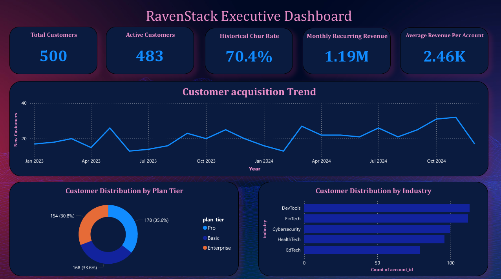
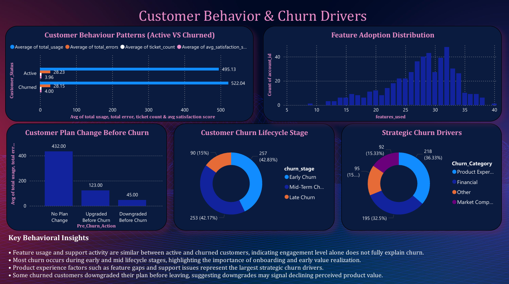
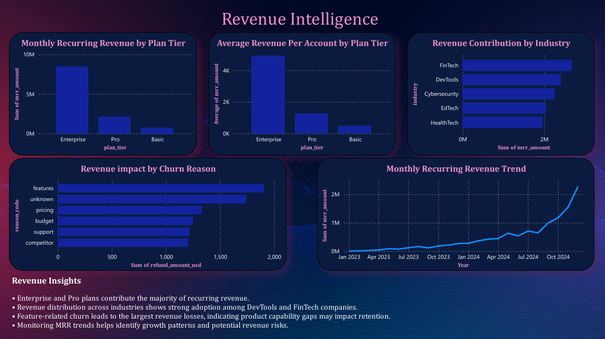
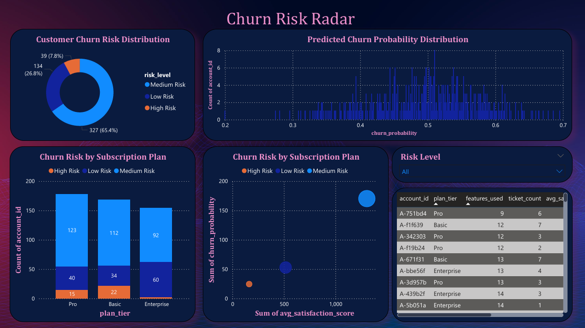
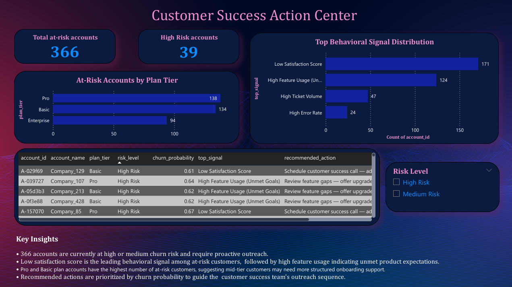

# RavenStack: Behavioral SaaS Churn Analysis

**Author:** Harini Mukesh | Psychology Graduate & Data Analyst  
**Tools:** Python · SQL (MySQL) · Power BI  
**Dataset:** RavenStack Synthetic SaaS CRM — *Credit: River @ Rivalytics (MIT License)*

---

## What Makes This Project Different

Most churn analyses compare lifetime metrics between churned and active customers.  
This project applies a **behavioral psychology lens** — examining how customer behavior *changes* in the period leading up to churn, and connecting those patterns to established psychological frameworks.

> *"Customers who are about to churn don't dramatically change their usage — they quietly stop seeking support. The absence of tickets in the pre-churn window, not the presence, is the warning signal."*

---

## Project Overview

RavenStack is a stealth-mode SaaS startup delivering AI-driven team tools. This end-to-end analysis investigates what drove customer churn before their public launch — combining SQL exploration, behavioral pattern analysis, machine learning, and business intelligence dashboards into a single connected project.

### Analysis Pipeline

```
Raw Data (5 tables)
      ↓
SQL Exploratory Analysis
      ↓
Python: Behavioral Pattern Analysis
      ↓
Python: Churn Prediction Model
      ↓
Power BI: Business Intelligence Dashboards
      ↓
Customer Success Action Export
```

---

## Behavioral Frameworks Applied

| Framework | Where Applied |
|---|---|
| **Engagement Decay Theory** | Pre-churn usage pattern analysis — does engagement drop before churn? |
| **Expectation-Disconfirmation Theory** | Explains why highly engaged customers still churn |
| **Learned Helplessness** | Explains the support ticket drop in the 90 days before churn |
| **Cognitive Dissonance** | Explains why customers who upgrade are more likely to churn |

---

## Key Findings

**1. Engagement alone does not predict churn**  
Churned customers show similar feature usage to active customers — they were not disengaged. This points to unmet expectations rather than loss of interest.

**2. Support ticket drop is the real warning signal**  
In the 90 days before churn, support tickets drop significantly (1.26 vs 2.97 in the earlier period). Customers stop seeking help before they leave — a pattern consistent with learned helplessness.

**3. Early lifecycle is the highest risk window**  
85% of churn occurs within the first year. Onboarding experience and early value realization are the most critical retention levers.

**4. Upgrades precede churn**  
A significant portion of customers churn shortly after upgrading their plan — suggesting the upgraded experience failed to meet raised expectations.

**5. Feature breadth increases churn risk**  
Customers using more unique features are more likely to churn. Broader adoption raises expectations that the product ultimately fails to meet.

---

## Dashboard Preview

### Executive Dashboard


### Customer Behavior & Churn Drivers


### Revenue Intelligence


### Churn Risk Radar


### Customer Success Action Center


---

## Tech Stack

| Tool | Purpose |
|---|---|
| MySQL | Database creation, data cleaning, exploratory analysis |
| Python (Pandas, Scikit-learn, Matplotlib, Seaborn) | Behavioral analysis, feature engineering, churn prediction model |
| Power BI | Interactive dashboards and business intelligence |
| Git / GitHub | Version control and project documentation |

---

## Churn Prediction Model

**Algorithm:** Logistic Regression with class balancing  
**Why Logistic Regression:** Interpretable coefficients allow us to explain *why* a customer is flagged as high risk — essential for translating model output into business action.

**Key decisions:**
- Used `class_weight='balanced'` to handle class imbalance (78% active, 22% churned)
- Used one-hot encoding for `plan_tier` to avoid false ordinal relationships
- Prioritized recall over accuracy — in a business context, missing a churner is more costly than a false alarm

**Risk Scoring Output:**

| Risk Level | Threshold | Accounts |
|---|---|---|
| High Risk | ≥ 60% churn probability | 39 |
| Medium Risk | 45% – 59% | 327 |
| Low Risk | < 45% | 134 |

---

## Project Outputs

**`churn_risk_predictions.csv`** — Full risk scores for all 500 accounts (used in Power BI)

**`customer_success_actions.csv`** — Prioritized action list for the customer success team including:
- Churn probability and risk level per account
- Top behavioral signal driving their risk
- Recommended action based on that signal

---

## Repository Structure

```
Behavioral_SaaS_Churn_analysis/
│
├── data/
│   ├── raw/
│   │   ├── ravenstack_accounts.csv
│   │   ├── ravenstack_subscriptions.csv
│   │   ├── ravenstack_feature_usage.csv
│   │   ├── ravenstack_support_tickets.csv
│   │   └── ravenstack_churn_events.csv
│   └── processed/
│       ├── churn_risk_predictions.csv
│       └── customer_success_actions.csv
│
├── images/
│   ├── 01_Executive_Dashboard.png
│   ├── 02_Customer_Behavior_Churn_Drivers.png
│   ├── 03_Revenue_Intelligence.png
│   ├── 04_Churn_Risk_Radar.png
│   ├── 05_Customer_Success_Action_Center.png
│   ├── pre_churn_behavioral_signals.png
│   └── feature_importance.png
│
├── notebooks/
│   └── churn_prediction_model.ipynb
│
├── powerbi/
│   └── Analysis_Dashboards.pbix
│
├── sql/
│   ├── Creating_database.sql
│   └── Exploratory_analysis.sql
│
├── requirements.txt
├── .gitignore
└── README.md
```

---

## How to Run

**SQL:**
1. Import raw CSVs into MySQL using Table Data Import Wizard
2. Run `sql/Creating_database.sql` to create and populate tables
3. Run `sql/Exploratory_analysis.sql` for exploratory analysis

**Python:**
1. Install dependencies: `pip install -r requirements.txt`
2. Open `notebooks/churn_prediction_model.ipynb`
3. Run all cells top to bottom
4. Outputs saved to `data/processed/`

**Power BI:**
1. Open `powerbi/Analysis_Dashboards.pbix`
2. Update data source paths to your local `data/processed/` folder
3. Click Refresh

---

## Dataset

Synthetic SaaS CRM data representing 500 customer accounts across 5 tables:
accounts · subscriptions · feature_usage · support_tickets · churn_events

**Credit:** River @ Rivalytics — [Rivalytics Medium Blog](https://rivalytics.medium.com)  
**License:** MIT-like — free to use for learning and portfolio purposes with attribution.

---

## Author

**Harini Mukesh**  
Psychology Graduate (M.Sc., University of Madras) | Data Analyst  
Combining behavioral science with data analytics to build human-centered insights.

[](https://github.com/HariniMukesh)
